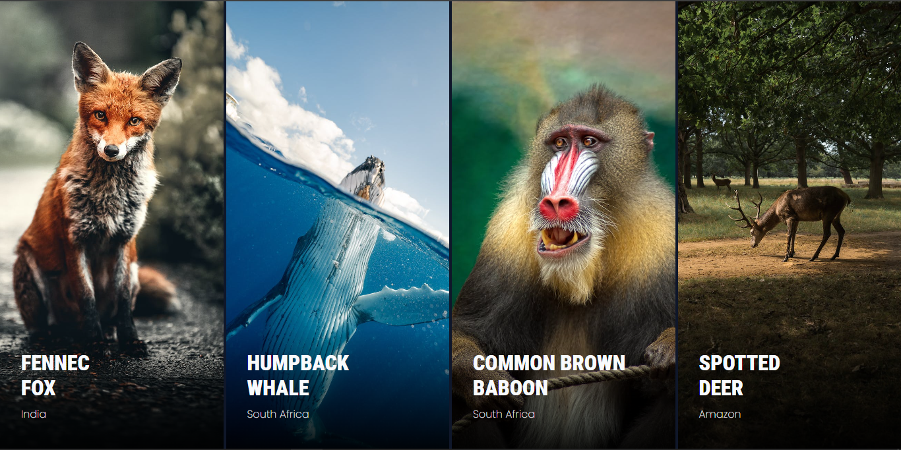
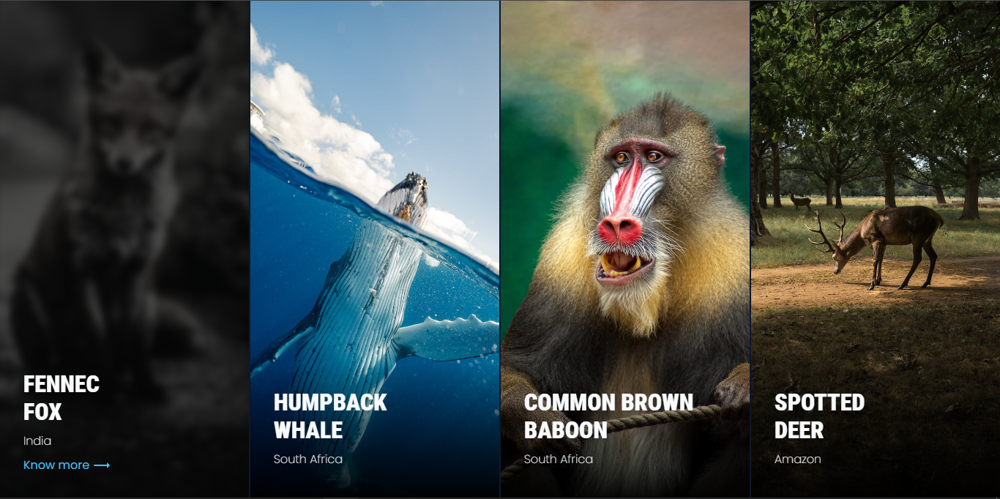

# COA-challenge




**Live Site URL:** [COA-challenge](https://coa-challenge.vercel.app/)

## Overview

COA-challenge is a web application showcasing an interactive gallery of animal images. It features elegant overlay effects upon image hover, providing users with a visually engaging experience. The project aims to demonstrate the implementation of modern web design techniques and user interaction enhancements.

## Table of Contents

- [Features](#features)
- [Installation](#installation)
- [Usage](#usage)
- [Code Structure](#code-structure)
- [Technologies](#technologies)
- [Solutions to Coding Challenges](#solutions-to-coding-challenges)


## Features

- **Interactive Gallery:** Users can hover over images to reveal overlay effects with additional information.
- **Smooth Transitions:** Seamless transitions enhance the user experience, providing a polished look and feel.

## Installation

To run the project locally, follow these steps:

1. Clone the repository:

   ```sh
   git clone https://github.com/yourusername/COA-challenge.git
   ```

2. Open the project directory and launch `index.html` in your preferred web browser.

## Usage

Simply open the `index.html` file in your web browser to explore the interactive gallery.

## Code Structure

The project follows a structured organization:

- **HTML:** Defines the gallery container, image wrappers, photo frames, overlays, and details sections.
- **CSS:** Styles the gallery, photo frames, and overlay effects for a visually appealing presentation.
- **JavaScript:** Manages hover effects by adding and removing the active class on the overlay elements.

## Technologies

The project utilizes the following technologies:

- HTML
- CSS
- JavaScript

## Solutions to Coding Challenges

### Problem 1: Contiguous Subarray Sum

- **Description:** Determines if there exists a contiguous subarray within an array that sums up to a target.
- **Implementation:** Utilizes the sliding window technique for an efficient solution.

#### Example:

```javascript
const arr = [4, 2, 7, 1, 9, 5];
const target = 14;
console.log(hasSubarrayWithSum(arr, target));
//true
```

### Problem 2: String Transformation

- **Description:** Transforms a string based on length divisibility by 3, 5, or both.
- **Implementation:** Applies conditional logic to reverse the string, replace characters with ASCII codes, or perform both operations.

```javascript
let input = "Amsterdam";
let output = transformString(input);
console.log(`Output: "${output}"`); 
// Output: "madretsmA"

let input = "hanga";
let output = transformString(input);
console.log(`Output: "${output}"`); 
//Output: "104 97 110 103 97"
```