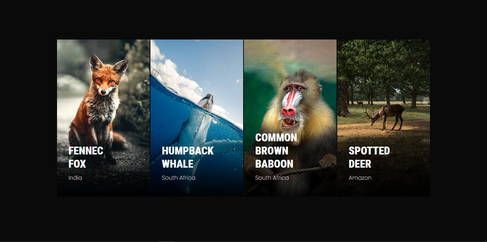
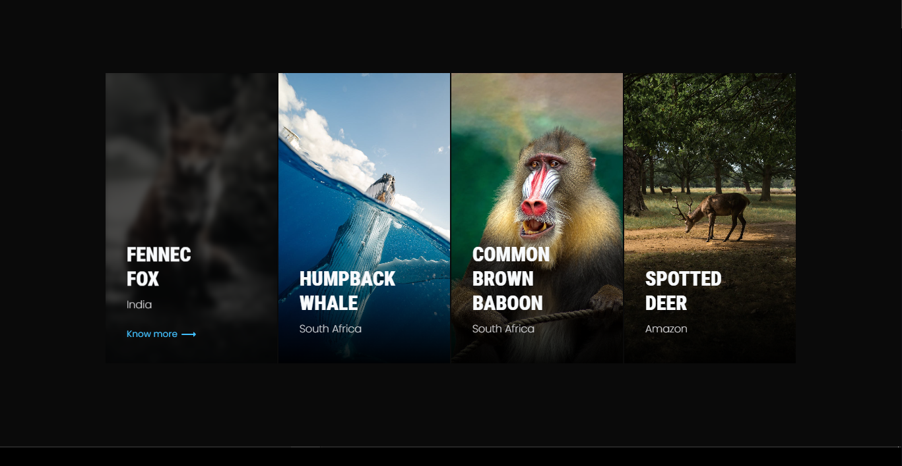

# COA-challenge




Live Site URL: [COA-challenge](https://coa-challenge.vercel.app/)

This project presents a gallery of animal images with overlay effects on hover, designed to showcase different animals and provide additional information when the user interacts with the images.

## Table of Contents

- [Features](#features)
- [Installation](#installation)
- [Usage](#usage)
- [Code Structure](#code-structure)
- [Technologies](#technologies)
- [License](#license)

## Features

- Image gallery with hover effects
- Overlay with additional information
- Smooth transitions

## Installation

1. Clone the repository:

   ```sh
   git clone https://github.com/yourusername/COA-challenge.git


Usage
Open index.html in your preferred web browser.
Code Structure
HTML
The HTML file includes a gallery container with multiple image wrappers. Each image wrapper contains a photo frame with an image, an overlay, and a details section.

CSS
The CSS file includes styles for the gallery, photo frames, and overlay effects.

JavaScript
The JavaScript file handles the hover effects, adding and removing the active class on the overlay.

Technologies
HTML
CSS
JavaScript
License
This project is licensed under the MIT License.
`https://coa-challenge.vercel.app/`
